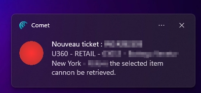
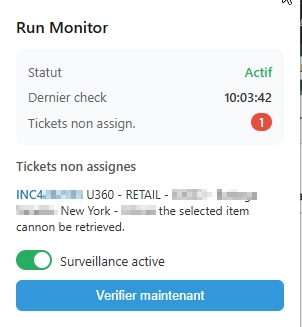

# ServiceNow Run Monitor

A Chrome extension (Manifest V3) that monitors a ServiceNow dashboard and sends desktop notifications when new unassigned tickets appear.

## Features

- Automatic polling every 5 minutes
- Desktop notification when new unassigned tickets appear
- Badge counter on the extension icon showing the current unassigned ticket count
- Manual check via the popup
- Enable/disable monitoring toggle

## Installation (Developer Mode)

1. Clone or download this repository
2. Open `chrome://extensions/` in Chrome
3. Enable **Developer mode** (toggle in the top right)
4. Click **Load unpacked** and select this folder
5. The extension icon appears in the toolbar

After any code change:
- Click the reload icon next to the extension on `chrome://extensions/`
- For changes to `content.js` or `config.js`, also reload the target ServiceNow tab

## How It Works

1. A `chrome.alarms` alarm fires every 5 minutes
2. The background service worker finds the first open ServiceNow tab and reloads it
3. Once the page is loaded, the content script scrapes the ticket table and returns the data
4. The background compares the new tickets against the previously seen set (`knownTicketIds`)
5. A desktop notification is sent for each newly detected unassigned ticket
6. The badge and stored state are updated

## Screenshots
Notification example when new unassigned tickets are detected



Extension popup showing current status



## Multiple ServiceNow Tabs

When multiple ServiceNow tabs are open, the extension uses **the first tab returned by `chrome.tabs.query()`**, which is typically the oldest open tab. Only that tab is reloaded and scraped each cycle. Other ServiceNow tabs are not affected.

## Configuration

Edit `config.js` to adjust the extension's behavior:

- **`POLL_INTERVAL_MINUTES`** — polling frequency (default: `5`)
- **`SELECTORS`** — CSS selectors targeting the dashboard table columns

The selectors are positional (`td:nth-child(N)`) and target `tr.list_row` rows inside the ServiceNow iframe (`#gsft_main`). If tickets stop appearing, check these selectors first — any change to the dashboard column layout will break scraping.

## Architecture

```
ServiceNow tab (DOM)
  → content.js     scrapes tickets via CSS selectors from config.js
  → background.js  compares with knownTicketIds, sends notifications, updates badge
  → popup.js       displays status on icon click
```

| File | Role |
|---|---|
| `manifest.json` | Extension manifest (MV3) |
| `background.js` | Service worker: polling, tab management, notifications, state |
| `content.js` | Content script: DOM scraping, iframe handling |
| `config.js` | CSS selectors and polling interval |
| `popup.html/js/css` | Popup UI: status, toggle, manual check |

### Message protocol

| Message | From | To | Purpose |
|---|---|---|---|
| `REQUEST_SCRAPE` | background | content | Trigger a scrape |
| `TICKETS_UPDATE` | content | background | Deliver scraped tickets |
| `FORCE_CHECK` | popup | background | Trigger an immediate check |
| `GET_STATUS` | popup | background | Read current state |

### Persisted state (`chrome.storage.local`)

| Key | Type | Description |
|---|---|---|
| `enabled` | boolean | Whether monitoring is active |
| `knownTicketIds` | string[] | IDs seen in the last check (deduplication) |
| `lastCheck` | number | Timestamp of the last check |
| `lastTickets` | object[] | Full ticket list from the last check |
| `unassignedCount` | number | Count displayed on the badge |
